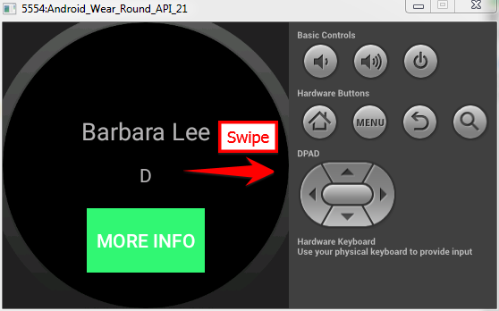
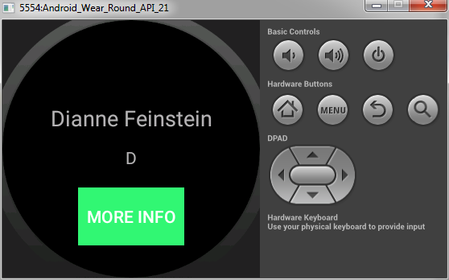
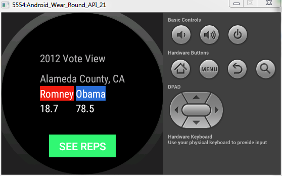
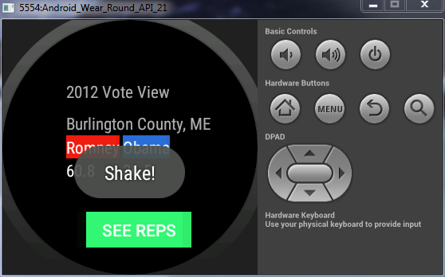

# PROG 02: Represent!

See the documentation PDF Here above in the GitHub Repo (Prog-02C Documentation.pdf)

## Authors

Micah Lyle ([micah.lyle@berkeley.edu](mailto:micah.lyle@berkeley.edu))

## Demo Video

See [Know Your Reps Demo Video] (https://youtu.be/3noXffw7RDw)

## Screenshots

## Acknowledgments

* Different people on stackoverflow, especially the guy who did the watch shake
* http://stackoverflow.com/questions/2317428/android-i-want-to-shake-it
* You can see the different contributions in different files there are comments throughout
* the files attributing credit to various websites, stack overflow posts, etc.
